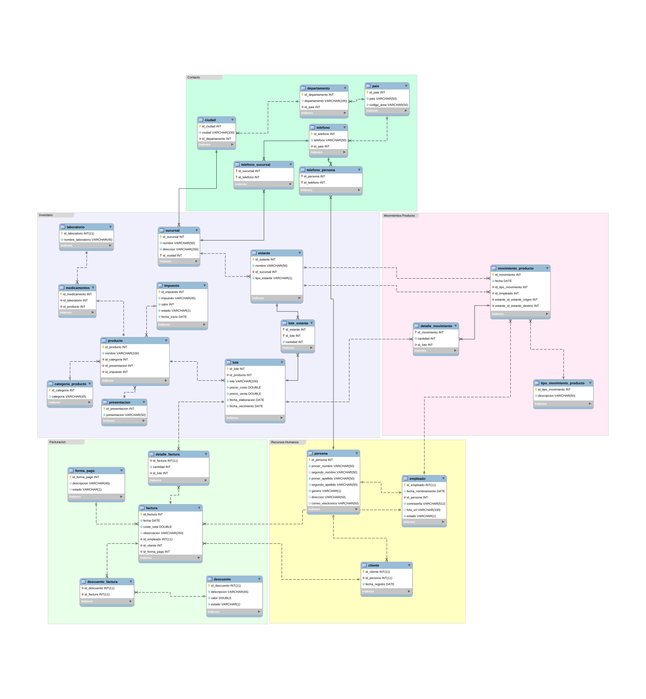

# Proyecto Bases de Datos II
*Presentado por:*
1. Antonio Aguilar **(jaguilar992)**
1. Nicolle Valladares **(nicollev7)**
1. Alejandra Núñez **(androimeda)**
1. Ariel Guardado **(EliteArmy)**
1. Christian Flores**(ChristhianFlores)**

[TOC]

## Base de Datos OLTP

### Modelo Relacional

## Base de Datos OLAP
## Base de Datos ETL